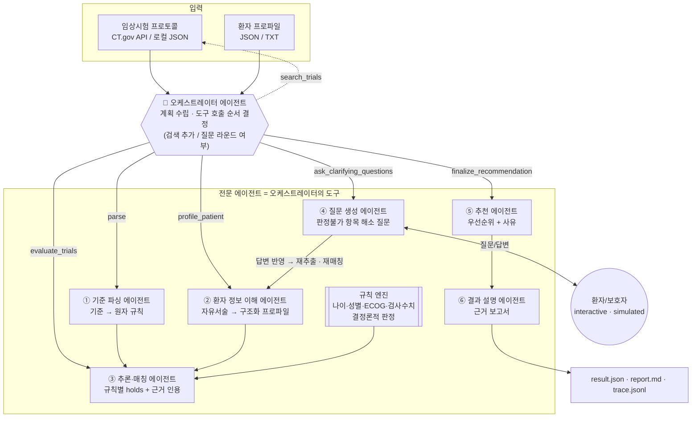
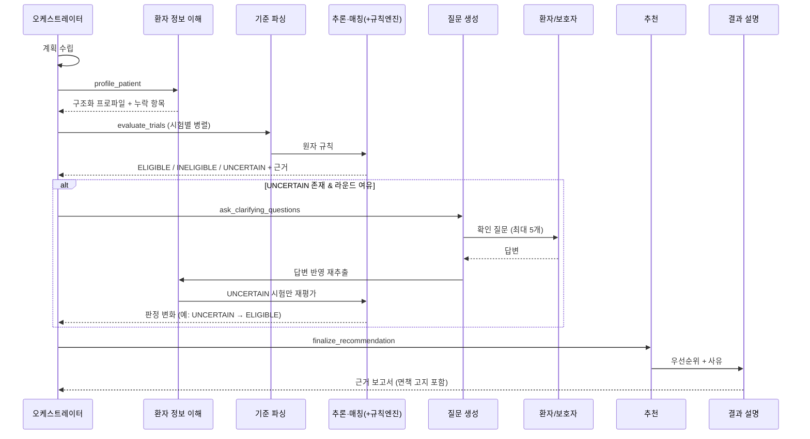

# ctrec: 인터랙티브 임상시험 추천 멀티 에이전트 시스템

**Healthcare Agentic AI Challenge 2026** 제출용 코드입니다. 주제는 *Interactive Clinical Trial Recommendation*입니다.

이 시스템은 임상시험 프로토콜의 선정/제외 기준과 상세 설명을 환자 정보와 대조해 참여 가능성을 **근거와 함께 판정**합니다. 정보가 부족하면 **확인 질문을 생성**해 답변을 반영한 뒤 다시 평가하고, 마지막으로 환자별로 가장 적절한 임상시험을 **우선순위와 함께 추천**합니다.

역할이 나뉜 6개의 전문 에이전트와 이를 지휘하는 오케스트레이터 에이전트가 함께 동작합니다. 오케스트레이터는 스스로 계획을 세우고 도구를 호출하므로, 단일 질의응답형 챗봇이 아닙니다.

> ⚠️ **의료적 면책 고지**
> 이 시스템의 출력은 연구·교육 목적의 **참고 자료**이며 의학적 자문, 진단, 치료 권고가 아닙니다. 임상시험 참여 여부는 반드시 담당 의료진 및 해당 임상시험 연구진과 상담해 결정해야 합니다. 모든 보고서(`report.md`)와 결과 파일(`result.json`)에는 이 고지가 자동으로 포함됩니다.

### 저장소

| 구분 | 주소 |
|---|---|
| 팀 저장소 | https://github.com/seoyeon488/workseoyeon |
| 개인 저장소 | https://github.com/rlaehdrua/clinical-recommendation-multi-agent-ai |

---

## 1. 전체 파이프라인

### 1.1 과제의 6단계와 구현 대응

| 단계 | 과제 요구사항 | 담당 에이전트 / 모듈 | 산출물 |
|---|---|---|---|
| ① 기준 입력 | 선정·제외 기준과 상세 설명 입력 | `tools/ctgov.py` (CT.gov API v2, 로컬 JSON) | `TrialRecord` |
| ② 환자 정보 입력 | 인구학·병력·검사·투약 프로파일 | `pipeline.load_patients` (JSON/TXT, TREC topics 형식) | `PatientCase` |
| ③ 정보 추출 및 매칭 | 기준 파싱 → 환자 정보 추출 → 조건 매칭·추론 → 근거 제시 | 기준 파싱 → 환자 정보 이해 → **규칙 엔진 + 추론·매칭** | `ParsedTrial`, `PatientProfile`, `TrialMatch` |
| ④ 부족 정보 탐지 | 충족이 불확실하거나 누락된 항목 식별 | 추론·매칭 에이전트 (`holds="unknown"`, `missing_info`) | `UNCERTAIN` 판정과 누락 항목 |
| ⑤ 질문 생성 및 재평가 | 확인 질문 → 추가 정보 반영 → 최종 판정 | 질문 생성 에이전트 → 답변 제공자 → 환자 정보 재추출 → 재매칭 | `QAPair`, 판정 변화 이력 |
| ⑥ 임상시험 추천 | 가장 적절한 시험 추천과 우선순위 | 추천 에이전트 → 결과 설명 에이전트 | `Recommendation`, `report.md` |

### 1.2 에이전트 구성도 (역할과 오케스트레이션)



### 1.3 오케스트레이션 흐름 (agent 모드)



### 1.4 설계 원칙

- **근거 기반 판정**: 모든 규칙 판정에는 환자 원문 인용(`evidence`)과 추론 과정(`reasoning`)이 붙습니다. 근거가 없으면 `unknown`으로 판정하며, 정보가 없다는 이유만으로 "해당 없음"이라고 가정하지 않습니다.
  - 이 원칙은 프롬프트뿐 아니라 **코드로도 강제**합니다. 매칭 에이전트는 판정마다 근거 유형(`explicit` 명시 / `inferred` 추론 / `absent` 정보 없음)을 함께 냅니다.
  - **확정 판정은 기록에 명시된 근거(`explicit`)가 있을 때만 인정**합니다. `inferred`나 `absent`인데 확정 판정을 내리면 코드가 `unknown`으로 되돌립니다. 모델이 스스로 매긴 확신도는 기준으로 쓰지 않습니다. 실제로 모델이 추론에도 `high`를 매겨 통과하는 사례가 있었기 때문입니다. 되돌린 항목은 확인 질문 대상이 됩니다.
  - 그래서 모델을 바꿔도 같은 기준이 유지됩니다. 실제로 Sonnet은 "62세이므로 폐경 후일 것"처럼 추정해 질문 단계를 건너뛰는 경향을 보였고, 이 규칙으로 바로잡았습니다.
- **LLM과 코드의 역할 분리**
  - 나이·성별·ECOG·수치형 검사값은 **결정론적 규칙 엔진**이 먼저 판정해 산술 오류를 막습니다.
  - 시험 단위 최종 적격성은 **코드가 정한 결정 규칙**으로 계산합니다. 선정 기준 불충족이나 제외 기준 해당이 하나라도 있으면 `INELIGIBLE`, 그렇지 않고 판정 불가 항목이 있으면 `UNCERTAIN`, 모두 통과하면 `ELIGIBLE`입니다.
  - 추천 에이전트가 이 판정과 어긋나는 출력을 내면 코드가 교정합니다.
- **최종 추천은 1개**: 후보 시험(질환별로 미리 정한 2–3개, `data/topic_map.json`)을 모두 평가한 뒤, 가장 적합한 시험 1개를 `recommended`로 추천하고 `selection_reason`에 차순위와 비교한 선정 이유를 적습니다.
  - 적합성이 실질적으로 구분되지 않을 때만 공동 1순위로 함께 추천합니다. 공동 순위는 적격성 등급이 같을 때만 인정하고(적격 > 판정 보류), 나머지는 차순위 후보(`ranked`)로 남깁니다.
- **추천 가능 조건과 '추천 없음' 사유**: 시험은 **적격성(ELIGIBLE/UNCERTAIN)**과 **현재 모집 상태(모집 중·모집 예정)**를 모두 만족해야 추천됩니다.
  - 완료·조기 종료·철회 등 모집이 끝난 시험은 적격이어도 추천하지 않습니다. 대신 제외 목록에 "모집 종료된 시험으로 현재 참여 불가"라는 사유와 적격성 결과를 함께 남깁니다.
  - 추천할 시험이 하나도 없으면 코드가 상황별 이유를 `no_recommendation_reason`에 명시합니다. 이 이유는 콘솔 출력, `result.json`, `report.md` 맨 위에 모두 표시됩니다. 예: *"현재 진행 중인 적절한 임상시험이 없습니다. 환자 조건에 맞는 시험(NCT00195949)이 있었으나 후보 시험 2개가 모두 모집이 종료되었습니다: …"*
  - 이 경우 추천 에이전트(LLM)는 호출하지 않습니다.
  - 확인 질문도 모집 중인 시험의 미확인 항목에 대해서만 합니다.
  - agent 모드에서 `--search`가 허용되면, 오케스트레이터는 후보가 모두 모집 종료일 때 모집 중인 시험을 추가로 검색합니다.
- **코호트별 기준과 조건부 기준**
  - **코호트별 기준**: 기준이 참여자 군(예: IM군 / 대조군, Cohort A / B)마다 다르면, 기준 파싱 에이전트가 각 규칙에 코호트를 표시합니다. 매칭은 "공통 기준 + 해당 코호트 기준"으로 코호트마다 따로 판정하고, 가장 유리한 코호트 결과를 채택해 `matched_cohort`와 `cohort_results`에 기록합니다. 다른 코호트 전용 기준(예: "대조군은 IM 의심 시 제외")이 판정을 막지 않습니다.
  - **조건부 기준**: "Men who can father a child: must use contraception"처럼 특정 집단에만 적용되는 기준에서 환자가 그 집단이 아니면 `applicable=false`로 표시하고 **해당 없음 = 통과**로 처리합니다. "해당 없음"과 "조건 불성립"을 구분하기 위한 장치입니다.
- **원문에 구체 기준이 없는 항목은 '의사 확인 필요'로 분류**: "Use of certain medications", "clinically significant abnormalities", "연구자 판단" 같은 기준은 공개된 원문에 약물 목록이나 기준값이 없어 시스템이 판정할 수 없습니다.
  - **기준 파싱**: 이런 기준에 `underspecified` 표시를 붙입니다. "환자 정보가 완벽해도 원문만으로 판정 불가한 경우"에만 붙이고, "Crohn's disease"처럼 구체적인 질환·소견은 제외합니다. 이 표시는 적격 판정을 막지 않으므로, 남발하면 잘못 적격으로 판정할 위험이 커집니다.
  - **매칭**: 적격 판정을 막지 않고 "의사 확인 필요"로 분류합니다. 예: `ELIGIBLE: 통과 5 / 불충족 0 / 판정불가 0 (+의사 확인 필요 1)`
  - **확인 질문**: 판정용 질문과 별도로 **의사 참고용 질문**(`purpose: physician_reference`)을 한 번 만들어 관련 사실을 수집합니다. 예: "현재 복용 중인 약(처방약, 일반의약품, 한약, 건강기능식품 포함)을 모두 알려주세요."
  - **추천·보고서**: 추천된 시험마다 해당 기준, 환자 응답, 기록상 복용 약물을 묶어 `physician_review`에 적습니다. `report.md`에는 코드가 **"의사 확인 필요 사항 (참고)"** 섹션을 고정으로 붙여, 참여 여부를 최종 결정할 때 담당 의사가 전체 프로토콜(금지 약물 목록 등)과 대조할 수 있게 합니다.
- **통일된 판정 의미**: 각 규칙은 "조건이 환자에게 성립하는가(`holds`)"로 판정합니다. 선정 기준은 `yes`여야, 제외 기준은 `no`여야 통과입니다.
- **구조화 출력**: 모든 에이전트 간 데이터는 Pydantic 스키마(`schemas.py`)와 Claude의 JSON schema 구조화 출력으로 주고받습니다.
- **LLM 출력의 기계적 검증**: 스키마가 맞는지에 더해, 내용이 입력과 어긋나지 않는지 코드로 확인합니다.
  - **파서 수치·부등호 검사**: 규칙 엔진이 쓸 비교값(`value`)이 기준 원문(또는 CT.gov 구조화 나이 필드)에 그대로 있는지, 부등호 방향이 원문 표현("이상/at least/≥" 등)과 같은지 검사합니다. 어긋나면 그 규칙의 구조화 필드를 비워 규칙 엔진 대신 LLM이 원문으로 판정하게 하고, 사유를 `parsing_notes`와 `trace.jsonl`(`integrity_issues`)에 남깁니다. 단위 환산값(예: "2 Weeks" → `0.038` years)도 원문에 없는 값이므로 걸러집니다.
  - **없는 ID 차단과 누락분만 재요청**: 매칭 에이전트가 요청하지 않은 `rule_id`를 지어내면 버립니다. 일부 규칙의 판정을 빠뜨리면 빠진 규칙만 다시 요청합니다(기본 1회, `CTREC_MATCHER_RETRIES`). 재요청한 규칙은 `TrialMatch.retried_rule_ids`에 기록되고, 그래도 빠진 규칙은 `unknown`("평가 누락")으로 남습니다.
- **추적 가능성**: 에이전트 호출, 계획, 도구 사용, 질문과 답변, 판정 변화가 `trace.jsonl`에 기록됩니다. 발표 시연에 그대로 활용할 수 있습니다.
- **개인정보 보호**: 질문 생성 에이전트는 이름, 연락처 같은 식별 정보를 묻지 않도록 제한되어 있습니다. 예시 환자는 모두 가상 데이터입니다.

---

## 2. 설치

Python 3.10 이상이 필요합니다.

```bash
python3 -m venv ~/.venvs/ctrec && source ~/.venvs/ctrec/bin/activate
pip install -e ".[dev,web]"      # 또는 pip install -r requirements.txt && pip install -e .
cp .env.example .env             # ANTHROPIC_API_KEY 입력
```

> **가상환경은 iCloud Drive 밖에 만드세요.** 프로젝트 폴더가 iCloud 안에 있으면 macOS가 가상환경 속 `.pth` 파일에 숨김 속성을 붙이고, Python 3.13이 이를 무시해 `ModuleNotFoundError: No module named 'ctrec'`가 발생합니다. 위 예시처럼 `~/.venvs/ctrec`에 만들면 이 문제가 없고, 패키지 파일 수천 개가 iCloud로 동기화되는 것도 막을 수 있습니다.

- 기본 모델은 `claude-sonnet-5`이며 `.env`의 `CTREC_MODEL`로 바꿀 수 있습니다(예: `claude-opus-5`).
- `ant auth login`으로 로그인한 프로필이 있으면 API 키 없이도 동작합니다.
- 재현성을 위해 실험에 사용한 환경은 `pip freeze > requirements.lock.txt`로 고정해 함께 제출하세요.

API 호출 없이 동작하는 단위 테스트로 설치를 확인할 수 있습니다.

```bash
pytest -q
```

---

## 3. 실행

### 3.1 빠른 시작 (가상 데모 데이터)

```bash
# 오케스트레이터(agent) 모드 + 가상 환자 시뮬레이터로 확인 질문 자동 응답
python -m ctrec run \
  --patient data/patients/synthetic/SYN-DEMO-A.json \
  --trials data/trials/DEMO-LUNG-001.json \
  --answers simulated
```

### 3.2 웹 UI (실시간 시연)

실제 파이프라인을 실행하면서 에이전트 협업 과정을 브라우저에서 실시간으로 보여줍니다. 발표 시연용입니다.

```bash
python -m ctrec.web              # http://127.0.0.1:8000 (--port로 변경)
```

| 영역 | 내용 |
|---|---|
| 입력 | 환자 선택(사업단 10명, 합성 32명) 또는 직접 입력. 후보 시험은 자동 선택되며 모집 상태가 함께 표시됩니다. 웹 UI는 항상 오케스트레이터(agent) 모드로 실행됩니다 |
| 에이전트 구성도 | 실행 중인 에이전트는 파란색, 완료된 에이전트는 초록색으로 표시됩니다. 오케스트레이터가 도구를 호출하면 해당 연결선이 켜집니다. 아래 단계 표시가 과제의 6단계 진행 상황을 보여줍니다 |
| 진행 로그 | 오케스트레이터의 계획(말풍선), 도구 호출, 에이전트별 결과, 질문과 답변이 실시간으로 쌓입니다 |
| 시험별 판정 | 시험마다 적격 / 부적격 / 판정 보류 배지를 표시하고, 판정 변화(예: 판정 보류 → 적격)를 보여줍니다 |
| 확인 질문 | 오케스트레이터가 필요하다고 판단할 때만 질문 폼이 뜹니다(필요 없으면 바로 결과). "모두 모름 · 건너뛰기"로 넘어갈 수도 있습니다. 파이프라인은 답을 받을 때까지 기다렸다가 재평가를 이어갑니다. 판정용 질문과 의사 참고용 질문은 구분해 표시됩니다 |
| 최종 추천 | **가장 적합한 시험 1개**(적합성이 구분되지 않으면 공동 1순위)와 선정 이유를 먼저 보여주고, 차순위 후보는 접어서 보여줍니다. 근거, 의사 확인 필요 사항, "추천 없음" 사유, 결과 설명 보고서, 토큰 사용량을 보여줍니다 |

- 서버는 이 컴퓨터(127.0.0.1)에서만 접속할 수 있습니다.
- 실행 기록은 `outputs/web/<실행 ID>/`에 저장됩니다.
- 실행할 때마다 Claude API 비용이 발생합니다. Sonnet 기준 환자 1명당 약 $0.2–0.7입니다.

### 3.3 사업단 제공 환자 + 실제 ClinicalTrials.gov 시험

사업단 제공 환자 10명(S001–S010)마다 CT.gov에서 관련 시험 2–3개를 골라 `data/trials/`에 저장해 두었습니다. 환자별 후보 시험은 `data/topic_map.json`에 정의되어 있습니다.

```bash
# 사람이 직접 답하는 인터랙티브 모드 (S004: 방광암)
python -m ctrec run --patient data/patients/provided/synthetic-patients.json --patient-id S004 \
  --trials-dir data/trials --topic-map data/topic_map.json --answers interactive

# 오케스트레이터가 필요 시 CT.gov에서 후보 시험을 추가 검색
python -m ctrec run --patient data/patients/provided/synthetic-patients.json --patient-id S008 \
  --search --answers interactive

# 시험 프로토콜을 더 내려받기 (data/trials/에 캐시되어 재현성 확보)
python scripts/fetch_trials.py --condition "idiopathic pulmonary fibrosis" --max 5
python scripts/fetch_trials.py --nct NCT0XXXXXXX NCT0YYYYYYY
```

### 3.4 합성 평가셋 일괄 실행과 평가

합성 환자 파일에는 환자별 `candidate_trials`가 들어 있어, 각 환자를 해당 질환의 시험들과만 대조합니다.

```bash
# (A) 확인 질문 없이: 공개 서술만으로 판정 -> label_text_only와 비교
python -m ctrec batch --patients-dir data/patients/synthetic --trials-dir data/trials \
  --answers none --mode fixed --out outputs/no_qa --workers 4 --quiet
python eval/evaluate.py --labels data/labels/synthetic_labels.csv --outputs outputs/no_qa --label-column label_text_only

# (B) 확인 질문 + 가상 환자 응답: 숨은 정보를 얻은 뒤 판정 -> label과 비교
python -m ctrec batch --patients-dir data/patients/synthetic --trials-dir data/trials \
  --answers simulated --mode agent --out outputs/with_qa --workers 4 --quiet
python eval/evaluate.py --labels data/labels/synthetic_labels.csv --outputs outputs/with_qa --label-column label
```

(A)에서 판정 보류(UNCERTAIN)였던 쌍이 (B)에서 정답(ELIGIBLE)으로 바뀌는 비율이, 확인 질문 단계의 효과를 보여주는 핵심 지표입니다. `evaluate.py`는 이를 다음 지표로 나눠 출력합니다(`--json 경로`로 저장 가능, 정의는 `src/ctrec/metrics.py`).

| 지표 | 의미 | 방향 |
|---|---|---|
| Rescue | 서술만으로는 보류(`label_text_only=UNCERTAIN`)였고 실제로는 적격인 쌍 중 ELIGIBLE로 회복한 비율 | 높을수록 좋음 |
| Cleanup | 서술만으로는 보류였고 실제로는 부적격인 쌍 중 INELIGIBLE로 걸러낸 비율 | 높을수록 좋음 |
| False Removal | 정답 적격인데 부적격으로 제거한 비율 | 낮을수록 좋음 |
| Premature Match | 정답이 적격이 아닌데 적격으로 판정한 비율 | 낮을수록 좋음 |

> 현재 라벨에는 "서술만으로 보류 → 실제 부적격" 쌍이 없어 Cleanup은 `N/A (0/0)`로 나옵니다. 평가셋을 늘릴 때 이 유형을 추가해야 합니다.

**질문 예산별 성능 곡선**: 환자당 허용 질문 수를 바꿔 가며 같은 평가셋을 반복 실행하고, 예산마다 정확도·Rescue·안전 지표·질문 수·LLM 호출 수를 표로 모읍니다. "질문을 많이 해서 좋아졌다"와 "적은 질문으로 대부분의 개선을 얻었다"를 구분하기 위한 실험입니다. 재현성을 위해 fixed 모드 + 가상 환자 응답으로 고정합니다.

```bash
python scripts/budget_sweep.py --budgets 0,1,2,3,5 --workers 4
# -> outputs/budget_sweep/b<예산>/ (환자별 결과), frontier.csv, frontier.json
python scripts/budget_sweep.py --budgets 0,1,2,3,5 --reuse   # 다시 실행하지 않고 기존 결과만 집계
```

추천 지표(최종 추천 적중률, Precision@k)에서는 **정답 ELIGIBLE이면서 모집 중인 시험**만 정답 추천으로 봅니다. 적격 시험이 모두 모집 종료된 환자(예: 유문협착증 S007)는 "추천 없음"을 내야 정답이며, 이는 `'추천 없음' 정확도`로 따로 보고합니다.

> 판정 정확도(적격/부적격)는 모집 상태와 관계없이 계산합니다. 다만 모집 종료 시험에는 확인 질문을 하지 않으므로, S007-03처럼 모집 종료 시험에서만 판정 보류인 쌍은 (B)에서도 판정 보류로 남습니다.

### 3.4.1 정보 가리기 평가셋 (Controlled Masking)

기존 합성 평가셋에서 확인 질문 단계를 시험하는 쌍은 14개뿐이고, "서술만으로는 보류 → 실제로는 부적격"(Cleanup) 사례는 없었습니다. 그래서 정보가 모두 있는 합성 환자에서 **판정을 가르는 사실만 자동으로 숨겨** 평가 사례를 만듭니다.

```bash
# 평가셋 생성 (LLM 출력은 data/cache/benchmark/에 캐시되어 다시 실행해도 API를 호출하지 않음)
python scripts/build_masked_benchmark.py --workers 4

# 평가: 확인 질문 + 사실 단위 가상 환자
python -m ctrec batch --patients-dir data/patients/masked --trials-dir data/trials \
  --answers simulated --mode fixed --out outputs/masked --workers 4 --quiet
python eval/evaluate.py --labels data/labels/masked_labels.csv --outputs outputs/masked
```

**생성 과정**
1. **사실 분해**: 환자 전체 기록(공개 서술 + `hidden_details`)을 번호 붙은 원자 사실(F1, F2, …)로 나눕니다. 같은 내용을 두 번 적지 않게 하고, 사실 문장에 원문에 없는 숫자가 있으면 다시 요청합니다. 나이·성별·주 진단명만 '핵심 사실'로 표시하며, 핵심 사실은 숨기지 않습니다.
2. **결정 기준 주석**: (환자, 시험) 쌍마다 판정을 가르는 기준과 그 근거 사실 ID를 표시합니다. 정답 라벨과 모순되는 주석은 버리고, 목록에 없는 사실 ID는 버립니다.
3. **변형 생성** (모집 중인 시험만. 모집 종료 시험에는 확인 질문을 하지 않으므로 제외)

   | 유형 | 만드는 법 | 서술만 본 정답 → 전체 정답 |
   |---|---|---|
   | `full` | 모든 사실 공개 (정보가 다 있을 때의 기준선) | 원래 라벨 그대로 |
   | `rescue` | 적격 쌍에서 충족 기준 1개의 근거 사실을 숨김 | UNCERTAIN → ELIGIBLE |
   | `rescue2` | 적격 쌍에서 충족 기준 2개의 근거를 함께 숨김 (질문이 여러 개 필요) | UNCERTAIN → ELIGIBLE |
   | `cleanup` | 부적격 쌍에서 위반 기준의 근거 사실을 모두 숨김 | UNCERTAIN → INELIGIBLE |

4. **누출 검사**: 사실 하나를 숨겨도 다른 사실로 추론할 수 있으면 평가가 무의미합니다. 예를 들어 "근육침윤 없음"을 숨겨도 "검체의 배뇨근은 침범되지 않음"이 남아 있으면 답이 드러납니다. 그래서 별도 LLM이 **남은 사실만 보고** 숨긴 기준을 추론할 수 있는지 확인합니다. 추론 가능하면 단서 사실(`clue_fact_ids`)도 함께 숨기고 다시 검사하며(최대 3회), 그래도 새거나 핵심 사실이 단서면 그 변형을 버립니다.

**정답 격리**: 숨긴 사실과 정답(`oracle_facts`, `hidden_facts`, `masked_fact_ids` 등)은 환자 파일에 있지만 `pipeline._HIDDEN_KEYS`로 파이프라인 입력에서 빠집니다. "정답을 보지 말라"고 프롬프트로 지시하는 것이 아니라 입력에서 아예 제거합니다. 생성된 101명 전체에서 숨긴 사실 문장이 입력에 섞이지 않았음을 확인했습니다.

**사실 단위 가상 환자 (`FactRevealAnswerer`)**: `--answers simulated`로 실행하면, 사실 목록이 있는 환자는 이 시뮬레이터가 답합니다. LLM은 "어떤 사실 ID가 이 질문에 답하는가"만 고르고(질문당 최대 2개, 목록에 없는 ID는 버림), 답변 문장은 코드가 **사실 원문 그대로** 만듭니다. 그래서 묻지 않은 정보를 흘리거나 값을 지어낼 수 없습니다. 공개한 사실 ID는 `result.json`의 `revealed_facts`에 기록됩니다. 기존 환자는 이전처럼 `SimulatedPatientAnswerer`가 답합니다.

**추가 지표** (`masked_fact_ids` 열이 있는 라벨에서 자동 계산)

| 지표 | 의미 |
|---|---|
| 사례 유형별 정확도 | full / rescue / rescue2 / cleanup 각각의 정확도 |
| 숨긴 사실 회수율 | 결정 근거로 숨긴 사실 중 질문으로 되찾은 비율 (단서 사실은 제외) |
| 숨긴 사실 전부 회수한 비율 | 결정 근거 사실을 모두 되찾은 사례 비율 |
| 쓸모 있는 질문 비율 | 적격성 질문 중 숨긴 사실을 하나 이상 공개시킨 질문 비율 |
| 사실 1개 회수당 질문 수 | 질문 효율 |

질문 예산 곡선도 이 평가셋으로 만들 수 있습니다: `python scripts/budget_sweep.py --patients-dir data/patients/masked --labels data/labels/masked_labels.csv --out outputs/budget_sweep_masked`

> 주석과 누출 검사는 LLM이 한 것이므로, 발표 수치로 쓰기 전에 연구진이 표본을 검토해야 합니다. 생성 중 건너뛰거나 버린 사례와 그 사유는 `data/patients/masked/build_report.json`의 `warnings`에 있습니다.

### 3.5 주요 옵션

| 옵션 | 설명 | 기본값 |
|---|---|---|
| `--mode agent` | 오케스트레이터 에이전트가 계획을 세우고 도구 호출 순서를 결정 | ✅ |
| `--mode fixed` | 6단계를 고정 순서로 실행 (평가 재현성과 비교 실험용) | |
| `--answers interactive` | 터미널에서 사람이 직접 답변 (시연용) | |
| `--answers simulated` | 가상 환자의 `hidden_details`를 아는 LLM이 답변 (개발·평가용) | |
| `--answers none` | 답변 없이 질문만 기록 | ✅ |
| `--max-rounds N` | 확인 질문 최대 라운드 | 2 |
| `--question-budget N` | 환자 1명당 전체 라운드 합산 최대 질문 수 (질문 예산 실험용). 라운드당 한도(`CTREC_MAX_QUESTIONS`, 기본 5)와 남은 예산 중 작은 값만큼 묻습니다 | 제한 없음 |
| `--search` | CT.gov 추가 검색 허용 (agent 모드) | off |
| `--trials`, `--trials-dir`, `--nct` | 후보 시험 지정 | |
| `--patient-id` | 여러 환자가 든 파일에서 한 명만 실행 (`run`) | |
| `--workers N` | 환자 N명을 동시에 처리합니다. 로그에 환자 ID가 붙고 토큰 사용량은 환자별로 집계됩니다. `interactive` 답변 모드에서는 1로 고정됩니다. 시험별 병렬 처리(`CTREC_MAX_WORKERS`, 기본 4)와 곱해져 동시 API 호출 수가 정해지니, 429(rate limit) 오류가 잦으면 줄이세요 | 1 |
| `--topic-map` | 환자 ID → 후보 시험 ID 목록 JSON. 환자 파일에 `candidate_trials`가 있으면 그것이 우선합니다 | |

---

## 4. 입력과 출력 형식

### 4.1 입력

**임상시험 (JSON)**: `scripts/fetch_trials.py`로 받은 CT.gov 레코드 또는 직접 작성한 파일을 씁니다. 최소 필드는 `trial_id`와 `eligibility_criteria`입니다.

```json
{"trial_id": "NCT0XXXXXXX", "title": "...", "brief_summary": "...", "detailed_description": "...",
 "eligibility_criteria": "Inclusion Criteria:\n* ...\nExclusion Criteria:\n* ...",
 "sex": "ALL", "minimum_age": "18 Years", "overall_status": "RECRUITING"}
```

**환자 (JSON 또는 TXT)**: 아래 형식을 모두 지원하며, 한 파일에 여러 환자가 있어도 됩니다.

- 사업단 제공 형식(TREC topic): `{"topics": [{"num": "S001", "title": "환자 서술"}, ...]}`
- 단일 환자: `{"patient_id": "...", "text": "자유 서술 프로파일"}`
- 그 밖의 JSON은 모든 필드를 텍스트로 바꿔 처리합니다.

다음 필드는 평가·시뮬레이션용 메타데이터라서 파이프라인(환자 정보 이해 에이전트)에는 **전달되지 않습니다**: `hidden_details`(시뮬레이터 전용), `design_note`, `candidate_trials`, `base_topic`, `synthetic`, `labels`.

**정답 라벨 (`data/labels/synthetic_labels.csv`)**: `patient_id,trial_id,label,label_text_only,rationale`
- `label`: 전체 기록(`hidden_details`) 기준 정답. ELIGIBLE 또는 INELIGIBLE입니다.
- `label_text_only`: 공개 서술(`title`)만으로 본 정답. ELIGIBLE, INELIGIBLE, UNCERTAIN 중 하나입니다. 동의 의사나 방문 가능 여부 같은 절차 기준은 충족된 것으로 봅니다.
- `rationale`: 결정적인 기준에 대한 근거입니다.

### 4.2 출력 (`outputs/<patient_id>/`)

| 파일 | 내용 |
|---|---|
| `result.json` | 구조화 프로파일, 시험별 규칙 판정(근거·방법·신뢰도), 문답 기록, 판정 변화 이력, 추천 순위, 데이터 출처, 면책 고지 |
| `report.md` | 결과 설명 에이전트가 쓴 보고서: 환자 요약, 추천 표, 시험별 근거, 제외 사유, 문답, 남은 확인 사항. 코드가 고정으로 붙이는 섹션은 "추천 없음" 사유(해당 시)와 "의사 확인 필요 사항 (참고)"입니다. |
| `trace.jsonl` | 에이전트별 실행 로그 (오케스트레이터의 계획과 도구 호출, 질문과 답변, 오류) |

---

## 5. 평가 대응

| 평가 항목 | 비중 | 대응 |
|---|---|---|
| 매칭 정확성 | 30% | `eval/evaluate.py`로 계산합니다. 지표는 전체 정확도, 판정 확정 비율(coverage), 확정 판정 정확도, Rescue/Cleanup, False Removal/Premature Match, 혼동 행렬, 추천 Top-1 적중률, Precision@k입니다. 질문 예산별 곡선은 `scripts/budget_sweep.py`로 만듭니다(3.4 참고). `--mode fixed`와 `--mode agent`, `--answers none`과 `--answers simulated`를 비교하면 질문 라운드의 효과를 수치로 보여줄 수 있습니다. |
| 랩 내 정성 평가 | 30% | `report.md`의 규칙 단위 근거와 `trace.jsonl`의 에이전트 협업 과정을 근거로 평가받습니다. |
| 발표 | 40% | 1.2와 1.3의 구성도를 활용하고, `trace.jsonl`로 실제 오케스트레이션 흐름을 시연합니다. |

### 5.1 합성 평가셋 구성

사업단 제공 환자는 10명뿐이고, 한두 문장짜리 서술이라 정답 라벨도 없습니다. 그래서 같은 10개 질환 분야로 합성 평가셋을 만들었습니다.

| 항목 | 규모 |
|---|---|
| 질환 분야 | 10개 (S001–S010과 같은 분야: 급성 췌장염, 그레이브스병, 소아 신증후군, 방광암, 조짐 편두통, 털곰팡이증, 유문협착증, 특발성 폐섬유증, 전염성 단핵구증, 망막박리) |
| 실제 CT.gov 시험 | 25개 (분야별 2–3개) |
| 합성 환자 | 30명 (분야별 3명) + 데모 2명 |
| (환자, 시험) 라벨 | 77쌍. 전체 기록 기준 ELIGIBLE 35 / INELIGIBLE 42, 공개 서술 기준 UNCERTAIN 14 |

**분야별 환자 설계**
- 01번: 정보가 충분하고, 한 시험에는 적격이며 다른 시험에는 부적격입니다. 추천 순위를 평가하기 위한 사례입니다.
- 02번: 검사 수치, 병용 약물, 동반 질환 등 자연스럽게 서술된 기준 위반이 있습니다.
- 03번: 판정을 가르는 정보 1–3개를 공개 서술에서 빼고 `hidden_details`에만 넣었습니다. 확인 질문 단계를 평가하기 위한 사례입니다.

라벨은 각 시험의 선정/제외 기준을 한 줄씩 대조해 작성했고, 근거는 `rationale` 열에 남겼습니다. 다만 **평가에 쓰기 전에 연구진이 검토해야 합니다.** 특히 다음 판단은 해석에 따라 달라질 수 있습니다.
- NCT06833073의 중앙 병리 검토, NCT06530004의 기관·기간 제한은 행정 절차로 보고 라벨에 반영하지 않았습니다.
- NCT07616128의 "특정 약물 사용" 제외 기준은 원문에 약물 목록이 없습니다. 정답 라벨은 이 기준을 판정에 쓰지 않았고, 시스템도 "의사 확인 필요"로 분류합니다.
- 유문협착증 시험 2개(NCT00195949, NCT02415049)는 이미 완료된 시험입니다. 라벨은 모집 상태와 관계없이 기준 충족 여부만으로 정했습니다.

추가 합성 데이터는 다음 명령으로 만들 수 있습니다(Claude API 사용).

```bash
python scripts/generate_synthetic_patients.py --trial data/trials/NCT0XXXXXXX.json --n 6
```

---

## 6. 데이터 출처 및 라이선스

| 데이터 | 경로 | 출처 | 라이선스 / 이용 조건 |
|---|---|---|---|
| 임상시험 프로토콜 | `data/trials/NCT*.json` | [ClinicalTrials.gov](https://clinicaltrials.gov) API v2, U.S. National Library of Medicine | 공개 데이터. [ClinicalTrials.gov Terms and Conditions](https://clinicaltrials.gov/about-site/terms-conditions)를 따릅니다. 각 레코드의 `source.url`, `source.retrieved_at`에 원문 URL과 수집 시각을 기록합니다. |
| 가상 데모 시험 | `data/trials/DEMO-LUNG-001.json` | 본 프로젝트에서 직접 작성 (`"synthetic": true`) | 프로젝트 라이선스를 따릅니다. **실제 시험이 아닙니다.** |
| 합성 환자 · 정답 라벨 | `data/patients/synthetic/`, `data/labels/` | 본 프로젝트에서 작성 (Claude 사용, `"synthetic": true`). 시험 기준은 위 CT.gov 레코드를 참조 | 프로젝트 라이선스를 따릅니다. 실존 인물 정보가 없는 가상 데이터입니다. |
| 사업단 제공 환자 예시 (10건) | `data/patients/provided/synthetic-patients.json` | Healthcare Agentic AI Challenge 2026 사업단 (가상 증례, TREC topic 형식) | 사업단 제공 조건을 따릅니다. *(제공 조건 확인 후 기재)* |
| 환자–후보 시험 매핑 | `data/topic_map.json` | 본 프로젝트에서 작성 (S001–S010 → 관련 CT.gov 시험) | 프로젝트 라이선스를 따릅니다. |

**유의사항 준수**
1. 공개 활용이 허용된 데이터(ClinicalTrials.gov)와 사업단 제공 데이터만 사용합니다.
2. 개인식별정보와 비공개 의료정보를 사용하지 않습니다. 환자 데이터는 가상 데이터나 사업단 예시만 쓰며, 질문 생성 에이전트는 식별 정보를 묻지 않도록 제한되어 있습니다.
3. 모든 데이터의 출처와 라이선스를 위 표와 각 레코드의 `source` 필드에 명시합니다.

> 참고: 환자 텍스트는 Claude API(Anthropic)로 전송되어 처리됩니다. 실제 환자 데이터를 사용하는 경우 기관 규정과 데이터 이용 조건을 먼저 확인하세요.

---

## 7. 프로젝트 구조

```
.
├── README.md
├── pyproject.toml / requirements.txt / .env.example
├── src/ctrec/
│   ├── cli.py                  # 명령행 진입점 (run / batch)
│   ├── config.py               # 모델, 에이전트별 effort, 라운드 수 등
│   ├── llm.py                  # Claude API 공통 래퍼 (구조화 출력, 캐싱, refusal 처리)
│   ├── schemas.py              # 에이전트 간 데이터 스키마 (Pydantic)
│   ├── pipeline.py             # Session: 6단계 상태와 실행, fixed 모드
│   ├── orchestrator.py         # 오케스트레이터 에이전트 (agent 모드, tool use 루프)
│   ├── trace.py                # trace.jsonl 기록 (+ 웹 UI 실시간 구독)
│   ├── metrics.py              # 평가 지표 (정확도, Rescue/Cleanup, False Removal 등)
│   ├── web/                    # 웹 UI: app.py(FastAPI + SSE), static/index.html
│   ├── agents/
│   │   ├── criteria_parser.py  # 기준 파싱 에이전트
│   │   ├── patient_profiler.py # 환자 정보 이해 에이전트
│   │   ├── matcher.py          # 추론·매칭 에이전트 (+ 적격성 결정 규칙)
│   │   ├── question_generator.py # 질문 생성 에이전트
│   │   ├── answerers.py        # 답변 제공자 (interactive / simulated / none)
│   │   ├── recommender.py      # 추천 에이전트
│   │   └── explainer.py        # 결과 설명 에이전트
│   └── tools/
│       ├── ctgov.py            # ClinicalTrials.gov API v2 클라이언트
│       └── rule_engine.py      # 결정론적 규칙 엔진
├── scripts/
│   ├── fetch_trials.py         # CT.gov 프로토콜 수집
│   ├── generate_synthetic_patients.py  # 가상 환자와 정답 라벨 생성
│   ├── budget_sweep.py         # 질문 예산별 성능 곡선
│   └── build_masked_benchmark.py  # 정보 가리기 평가셋 생성
├── eval/evaluate.py            # 매칭 정확성 평가
├── tests/                      # API 없이 도는 단위 테스트 (test_offline, test_recommender, test_reliability, test_masked_benchmark)
└── data/
    ├── trials/                 # 시험 프로토콜 (CT.gov 캐시 + 가상 데모)
    ├── topic_map.json          # 사업단 환자 S001–S010 → 후보 시험
    ├── patients/synthetic/     # 합성 환자 30명 (cases_*.json) + 데모 2명
    ├── patients/provided/      # 사업단 제공 예시 10명
    ├── patients/masked/        # 정보 가리기 평가셋 101명 (masked_cases.json) + 생성 보고서 (build_report.json)
    └── labels/                 # 평가용 정답 라벨 (synthetic_labels.csv, masked_labels.csv)
```

---

## 8. 모델 및 비용 관련 참고

- **모델**: 모든 에이전트는 기본값 `claude-sonnet-5`를 씁니다($2 / $10 per 1M 입력·출력 토큰). 데모 환자 1명 기준 약 $0.2로, 같은 환자를 `claude-opus-5`로 돌렸을 때(약 $0.57)보다 저렴했습니다. 에이전트마다 추론 강도(`effort`)를 다르게 둡니다. 판정 정확도가 중요한 기준 파싱, 매칭, 추천, 오케스트레이터는 `high`이고, 추출과 문장 생성 위주 단계는 `medium`입니다. 값은 `config.py`의 `EFFORT`에서 조정합니다.
- **캐싱**
  - 에이전트별 시스템 프롬프트에 프롬프트 캐싱을 적용합니다.
  - 파싱된 시험 규칙은 `data/cache/parsed/`에 저장되어, 같은 시험을 여러 환자에 쓸 때 다시 파싱하지 않습니다. 모델이나 프롬프트, 시험 내용이 바뀌면 캐시 키가 자동으로 달라집니다.
- **안전 분류기 대응**: 의료 텍스트가 드물게 모델의 안전 분류기에 의해 거절될 수 있습니다. 이 경우를 대비해 Claude API의 서버측 refusal fallback(`fallbacks: "default"`)을 기본으로 켜 두었습니다. Bedrock이나 Vertex 등 다른 플랫폼에서는 `.env`에 `CTREC_FALLBACKS=0`을 설정하세요.
- **비용 규모**: 환자 1명 × 시험 N개 기준으로 대략 다음 횟수만큼 Claude를 호출합니다.
  - 기준 파싱: N회 (최초 1회만, 이후 캐시)
  - 매칭: N회
  - 질문 라운드: 라운드마다 3회 이상
  - 추천과 설명: 2회
  - agent 모드: 여기에 오케스트레이터 호출이 추가됩니다.

---

## 9. 한계와 향후 과제

- 규칙 엔진은 단위가 같은 수치 비교만 판정합니다. 단위 환산과 "정상 상한의 1.5배(ULN)" 같은 상대 기준은 LLM이 판정합니다.
- 확인 질문의 답변은 원문에 덧붙인 뒤 환자 정보를 다시 추출하는 방식으로 반영합니다. 답변이 기존 정보와 충돌하면 최신 답변을 우선합니다.
- 추천 우선순위는 적격성과 대상군 적합도, 모집 상태를 기준으로 합니다. 지리적 접근성이나 환자 선호는 반영하지 않습니다.
- 가상 데이터로 측정한 정확도는 실제 임상 환경의 성능을 보장하지 않습니다.

---

## 10. 변경 이력

수정할 때마다 무엇을 왜 바꿨는지 여기에 기록합니다. 최신 항목이 위에 옵니다.

### 2026-10-09 — 평가 데이터 키우기 (정보 가리기 평가셋 + 사실 단위 가상 환자)

배경: 1차 작업 후에도 확인 질문 단계를 시험하는 쌍이 14개뿐이고 Cleanup 사례는 0개라, 새 지표의 숫자를 믿기 어려웠습니다. 또 기존 가상 환자는 숨긴 기록 전체를 보고 자유롭게 답해, 질문하지 않은 정보까지 흘릴 수 있었습니다. 자세한 방법은 3.4.1 참고.

| # | 변경 | 파일 | 효과 |
|---|---|---|---|
| 1 | **정보 가리기 평가셋 생성 스크립트**: 사실 분해 → 결정 기준 주석 → 변형 생성 → 누출 검사 | `scripts/build_masked_benchmark.py`(신규) | 판정을 가르는 사실만 골라 숨긴 평가 사례를 자동 생성 |
| 2 | **생성된 평가셋** | `data/patients/masked/masked_cases.json`, `data/labels/masked_labels.csv`, `build_report.json`(신규) | 환자 101명, 라벨 140쌍. 아래 표 참고 |
| 3 | **사실 단위 가상 환자**: 질문이 직접 묻는 사실만 원문 그대로 공개, 공개 기록을 결과에 저장 | `agents/answerers.py`(`FactRevealAnswerer`, `RoutingAnswerer`), `cli.py`, `pipeline.py`(`revealed_facts`) | 시뮬레이터가 정보를 흘리거나 지어낼 수 없음. 어떤 질문이 숨긴 정보를 되찾았는지 추적 가능 |
| 4 | **정답 격리**: 평가셋의 정답 필드를 파이프라인 입력에서 제거 | `pipeline.py`(`_HIDDEN_KEYS`) | 101명 전체에서 숨긴 사실이 입력에 섞이지 않음을 확인 |
| 5 | **회수 지표**: 사례 유형별 정확도, 숨긴 사실 회수율, 쓸모 있는 질문 비율 등 | `metrics.py`, `eval/evaluate.py`, `scripts/budget_sweep.py` | 질문 단계를 "판정이 맞았나"뿐 아니라 "필요한 정보를 골라 물었나"로도 평가 |

**평가셋 규모 (이전 → 이후)**

| | 이전 (`synthetic_labels.csv`) | 이후 (`masked_labels.csv`) |
|---|---|---|
| 질문 단계 시험 쌍 (서술만으로 보류) | 14 | **72** (rescue 42 + rescue2 12 + cleanup 18) |
| Cleanup 사례 | 0 | **18** |
| 정보가 다 있는 기준선 | – | 68 (`full`) |
| 근거가 된 원본 환자 / 질환 분야 | – | 27명 / 10개 분야 전부 |

- 숨긴 결정 근거 사실은 사례당 1–5개(대부분 1–2개)이고, 누출을 막으려 함께 숨긴 단서 사실이 있는 사례는 29개입니다.
- 만들지 못한 사례: 부적격 쌍 14개는 위반 근거가 핵심 사실(나이·진단)이거나 숨길 사실이 너무 많아 건너뛰었고, 변형 33개는 누출 검사에서 버렸습니다. 사유는 모두 `build_report.json`에 있습니다.
- 소규모 시험 실행에서 발견해 고친 점: ① 사실 분해가 "두 번째 입원 7주 후" 같은 문장을 핵심 사실로 묶어 숨길 수 없게 만듦 → 핵심 사실을 나이·성별·진단명으로 제한 ② 원본 기록이 같은 내용을 여러 번 적어 단서가 많아짐 → 중복 제거, 단서 사실을 따로 기록하고 숨김 상한을 8개로.
- 테스트: `tests/test_masked_benchmark.py`에 5개 추가(전체 30개 통과).
- 아직 하지 않은 것: **이 평가셋으로 시스템을 실제로 돌리지 않았습니다**(환자 101명 × 확인 질문 라운드라 API 비용이 큼). 주석·누출 검사는 LLM 결과이므로 연구진 표본 검토가 필요합니다. `data/cache/`는 git에 올라가지 않으므로, 다른 사람이 생성 스크립트를 다시 실행하면 API를 다시 호출합니다(평가셋 파일 자체는 저장소에 포함).

### 2026-10-09 — 지난 대상팀 분석 반영 1차 (평가 지표·질문 예산·LLM 출력 검증)

배경: 지난 대상팀 분석 문서에서 "설계에 비해 실험·검증이 부족해지는 것"이 가장 큰 위험으로 지적되었습니다. 그래서 기존 코드에 바로 붙일 수 있는 4가지를 먼저 반영했습니다. 파이프라인 구조와 판정 규칙은 바꾸지 않았습니다.

| # | 변경 | 파일 | 효과 |
|---|---|---|---|
| 1 | **Rescue / Cleanup / False Removal / Premature Match 지표** 추가. 지표 계산을 `metrics.py`로 분리하고 `evaluate.py`에 `--json` 출력 추가 | `src/ctrec/metrics.py`(신규), `eval/evaluate.py` | 질문 단계가 "적격 후보를 살렸는지"와 "잘못 제거·성급한 적격 판정이 없었는지"를 따로 보고 |
| 2 | **질문 예산** `--question-budget` 옵션과 **예산별 성능 곡선** 스크립트 | `pipeline.py`, `cli.py`, `scripts/budget_sweep.py`(신규) | 질문 0, 1, 2, …개일 때의 정확도·Rescue·호출 수를 한 표(`frontier.csv`)로 비교 |
| 3 | **매칭 누락 규칙만 재요청** + 요청하지 않은 `rule_id` 버리기 | `agents/matcher.py`, `schemas.py`(`retried_rule_ids`), `config.py`(`MATCHER_MISSING_RETRIES`) | LLM이 일부 규칙을 빠뜨려도 시험 전체를 다시 평가하지 않고 빠진 규칙만 다시 물음. 그동안 "평가 누락"이 정보 부족 `unknown`과 섞여 UNCERTAIN을 만들던 문제가 줄어듦 |
| 4 | **파서 수치·부등호 검사**: 비교값이 원문에 없거나 부등호 방향이 반대면 규칙 엔진 대상에서 빼고 LLM 판정으로 전환 | `agents/criteria_parser.py`(`check_integrity`), `schemas.py`, `pipeline.py`(trace 기록) | 파서가 숫자를 바꿔도 규칙 엔진이 틀린 값으로 확정 판정하지 않음. 기존 파싱 캐시 39개(구조화 수치 규칙 약 120개)에 돌려 보니 단위 환산된 나이 2건(NCT02415049, "2 Weeks"→0.038 years)만 걸렸고 오탐은 없었음 |

- 테스트: `tests/test_reliability.py`에 9개를 추가했습니다(전체 25개 통과). 실행: `PYTHONPATH=src python -m pytest -q`
- 아직 실제 API로 평가셋을 다시 돌리지 않았습니다. 지표와 예산 스크립트는 가짜 결과 파일로만 동작을 확인했습니다. 실제 수치는 `budget_sweep.py` 실행 후 이 표에 추가합니다.
- 알려진 한계: 현재 라벨에 Cleanup 대상 쌍(서술만으로 보류 → 실제 부적격)이 0개라 Cleanup은 N/A입니다. 질문 단계를 시험하는 쌍도 14개뿐이라 예산 곡선의 통계적 힘이 약합니다. 다음 단계에서 평가셋 확대(판정에 쓰인 사실을 자동으로 숨기는 방식)와 가상 환자가 물어본 사실만 공개하도록 바꾸는 작업을 진행할 예정입니다.
